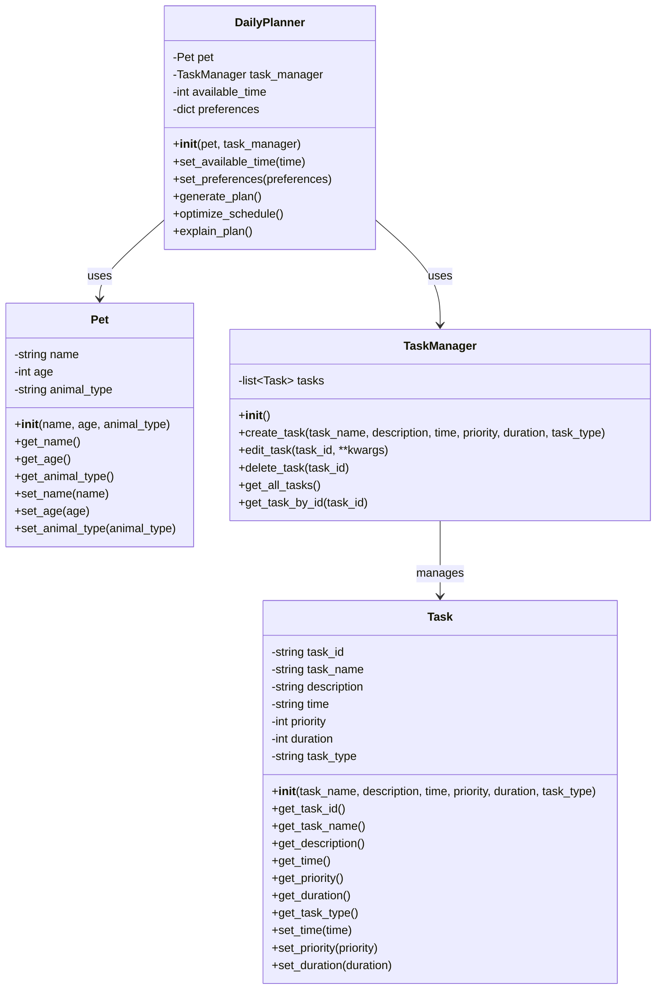

# PawPal+ Class Diagram

## Class Descriptions

### Pet
Stores information about the pet including name, age, and animal type (dog, cat, bunny, fish, etc.).

### Task
Represents a care task with details like name, description, scheduled time, priority, duration, and type (walk, feed, medication, grooming, playtime, etc.).

### TaskManager
Handles creating, editing, and deleting tasks. Maintains a collection of all tasks for the pet.

### DailyPlanner
Generates an optimized daily care plan using AI. Takes into account the pet information, available tasks, time constraints, and owner preferences to create a schedule.
